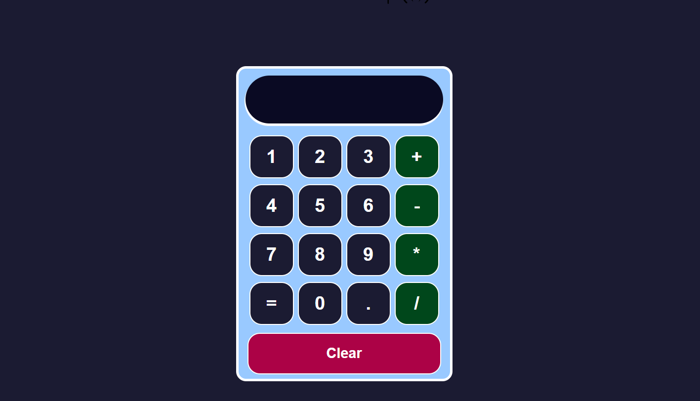

# Calculator React

Welcome to the Calculator project! In this project, we have created a functional calculator using web technologies such as HTML, CSS, JavaScript, and React. The calculator will allow you to perform basic mathematical operations such as addition, subtraction, multiplication, and division.



## Live Demo 

[Calculator WebSite](https://benevolent-pony-0ec4cb.netlify.app)

## Features

- The calculator utilizes React as a JavaScript library to create an interactive and dynamic user interface.
- React's `useState` is used to handle values and operations within the calculator.
- The `evaluate` function is employed to evaluate mathematical expressions entered by the user and display the results correctly.
- CSS has been applied to design an attractive and user-friendly interface.

## Prerequisites

Before getting started, ensure you have the following installed:

- Node.js: [Download and install Node.js](https://nodejs.org)
- NPM: Typically bundled with Node.js

## Getting Started

1. Clone this repository to your local machine or download the source code as a ZIP file.
2. Open a terminal and navigate to the project directory.
3. Run the following command to install the project dependencies:

   ```shell
   npm install

4. After completing the installation of dependencies, execute the following command to start the application:

   ```shell
   npm install

5. The calculator application will automatically open in your default browser. If it does not open automatically, go to your browser and access http://localhost:3000.

## Using the Calculator

- The calculator displays an interface with numeric buttons and mathematical operators.
- You can click on the numeric buttons to input numbers into the input field.
- The mathematical operator buttons allow you to perform addition, subtraction, multiplication, and division operations.
- Once you have entered a mathematical expression, click on the equals (=) button to obtain the result.
- The result will be displayed in the output field below the buttons.

## Contributions

Contributions to this project are welcome. If you want to make improvements, bug fixes, or add new features, you can fork the repository, make your changes, and submit a pull request.

## Contact

If you have any questions or suggestions related to this project, you can contact me via [email](mailto:kal2403199255@gmail.com).

## Author
This project was created by Cristhian Castillo. Feel free to contact me if you have any questions or suggestions to improve the project.

Thanks for checking out my project! If you find it useful, feel free to leave a star.
